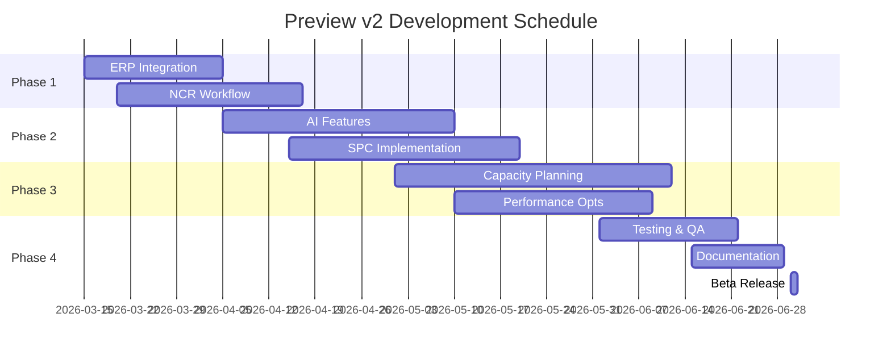

# 🔬 Preview v2 - Development Roadmap

**Branch:** preview-v2  
**Status:** 🚧 In Development  
**Target:** Q2 2026  
**Parallel met:** Pilot Ready (productie)

---

## 🎯 Strategie

Deze branch draait **parallel** aan de pilot-ready versie in productie. Hier kunnen we veilig experimenteren met nieuwe features zonder de stabiliteit van de pilot te beïnvloeden.

### Development Workflow

```
FpiFF-Pilot-Ready (STABLE)
    ├── Hotfixes only
    └── Critical bugs
    
preview-v2 (EXPERIMENTAL)
    ├── Nieuwe features
    ├── Performance optimalisaties
    ├── UI/UX verbeteringen
    └── Experimentele integraties
```

**Merge Strategie:**
- Pilot bugfixes worden **regelmatig** gemerged naar preview-v2
- Preview features worden **alleen** gemerged naar pilot na volledige testing
- Weekly sync meetings om priorities te bespreken

---

## 🚀 Preview v2 Features

### 1. ERP Integratie (Infor LN Sync) 🔗

**Priority:** 🔴 Hoog  
**Status:** 📋 Planning  
**Target:** Week 12-14 2026

#### Scope
- Automatische ophalen van orders uit Infor LN
- Real-time status updates terug naar ERP
- Master data sync (producten, klanten)
- Voorraad updates

#### Technical Approach
- `/functions/infor_sync_service.jsx` uitbreiden
- Webhook endpoints voor bidirectional sync
- Queue systeem voor batch updates
- Error handling en retry logic

#### Dependencies
- Infor LN API credentials
- Firewall/VPN configuratie
- Test environment setup

---

### 2. Advanced AI Features 🤖

**Priority:** 🟡 Gemiddeld  
**Status:** 📋 Planning  
**Target:** Week 15-18 2026

#### 2.1 Context-Aware Assistant
- Product-specifieke troubleshooting
- Historische data analyse voor suggestions
- Voice-to-text voor operator logs

#### 2.2 Predictive Maintenance
- Machine hour tracking
- Automatische maintenance alerts
- Pattern recognition voor recurring issues

#### 2.3 Quality Prediction
- AI model training op historische QC data
- Real-time defect probability scoring
- Proactive quality interventions

#### Technical Stack
- Google Gemini API (reeds geïntegreerd)
- TensorFlow.js voor client-side models
- Firestore ML collections voor training data

---

### 3. NCR Workflow Automation 📝

**Priority:** 🟠 Gemiddeld-Hoog  
**Status:** 📋 Planning  
**Target:** Week 16-19 2026

#### Features
- Digitale Non-Conformance Report aanmaken
- Foto upload met defect annotations
- Auto-assign naar quality team
- Root cause analysis templates
- Escalation flows (48h → manager)
- Trend analysis dashboard

#### Database Structuur
```
/future-factory/quality/
  ├── ncr_reports/
  │   ├── {ncr_id}/
  │   │   ├── reportData
  │   │   ├── photos[]
  │   │   ├── assignedTo
  │   │   ├── status
  │   │   └── resolution
  └── ncr_templates/
```

#### UI Components
- `NCRCreateModal.jsx`
- `NCRDashboard.jsx` (Quality team)
- `NCRDetailView.jsx`

---

### 4. Statistical Process Control (SPC) 📊

**Priority:** 🟡 Gemiddeld  
**Status:** 📋 Planning  
**Target:** Week 20-24 2026

#### Features
- Real-time control charts (X-bar, R-chart)
- Automatic out-of-control detection
- Cpk / Ppk calculations
- Trend visualization
- Alert system voor near-limit waarden

#### Integration Points
- Koppeling met `MeasurementInput` component
- Real-time Firestore listeners
- Export naar CSV/Excel voor analyse

#### Visualisatie
- Chart.js of D3.js voor interactieve grafieken
- Responsive dashboards voor tablets
- Print-friendly rapportages

---

### 5. Capacity Planning Optimization 🗓️

**Priority:** 🟡 Gemiddeld  
**Status:** 📋 Planning  
**Target:** Week 22-26 2026

#### Features
- Drag-and-drop order scheduling
- Machine capacity overview (per week)
- Bottleneck detection
- What-if scenario's
- Auto-optimization algoritme

#### Technical Implementation
- Gantt chart library (dhtmlxGantt of frappe-gantt)
- Constraint solver voor optimalisatie
- Integration met `time_standards` data

---

### 6. Mobile App (Progressive Web App → Native) 📱

**Priority:** 🔵 Laag  
**Status:** 📋 Planning  
**Target:** Q3 2026

#### Phase 1: PWA Improvements
- Offline-first architecture
- Service worker optimalisatie
- App manifest tuning
- Push notifications (reeds geïmplementeerd)

#### Phase 2: Native Wrapper
- React Native of Capacitor
- Native camera integration
- Barcode scanner lib upgrade
- Platform-specific optimalisaties

---

### 7. Multi-site Support 🌍

**Priority:** 🔵 Laag  
**Status:** 💡 Concept  
**Target:** Q4 2026

#### Features
- Site selection bij login
- Per-site configuration
- Cross-site order transfers
- Consolidated reporting

#### Database Refactor
```
/future-factory/
  ├── sites/
  │   ├── {site_id}/
  │   │   ├── production/
  │   │   ├── personnel/
  │   │   └── settings/
  └── global/
      ├── products/
      └── customers/
```

---

## 🔧 Performance Optimalisaties

### 1. Virtualized Lists (In Progress)
- ✅ PlanningSidebar (completed)
- 🚧 ProductSearchView
- 🚧 AdminReferenceTable
- 📋 TraceModal

### 2. Code Splitting
- Lazy load admin modules
- Route-based splitting uitbreiden
- Dynamic imports voor zware libraries

### 3. Firestore Query Optimization
- Composite indexes voor alle queries
- Query caching in hooks
- Batch listeners consolidatie
- Pagination voor grote datasets

### 4. Bundle Size Reduction
- Tree-shake unused exports
- Replace zware libraries (moment.js → date-fns)
- Image optimization
- Font subsetting

**Target:** -30% bundle size, -50% initial load time

---

## 🎨 UI/UX Verbeteringen

### 1. Dark Mode
- Theme context implementatie
- Tailwind dark: classes
- User preference persistence

### 2. Accessibility (A11Y)
- WCAG 2.1 AA compliance
- Keyboard navigation
- Screen reader optimization
- Focus indicators

### 3. Animations & Transitions
- Framer Motion integratie
- Page transitions
- Loading states
- Micro-interactions

### 4. Responsive Refinements
- Tablet landscape mode optimalisatie
- Touch target size audit
- Mobile menu verbeteringen

---

## 🧪 Testing & Quality

### 1. Unit Tests
- Vitest setup
- Core utils coverage (>80%)
- Component testing met React Testing Library

### 2. E2E Tests
- Playwright setup
- Critical user flows
- Regression test suite

### 3. Performance Testing
- Lighthouse CI
- Bundle analyzer
- Firestore query analytics

---

## 📦 Dependencies Upgrades

### Planned Upgrades
- React 18.3 → 19.0 (when stable)
- Vite 5 → 6 (when released)
- Firebase SDK latest
- TailwindCSS v4 (when stable)

### New Dependencies
- `@tanstack/react-query` - Server state management
- `zod` - Runtime type validation
- `react-hook-form` - Better form handling
- `framer-motion` - Animations

---

## 🔐 Security Enhancements

### 1. Advanced Auth
- 2FA met TOTP
- Session management
- IP whitelisting voor admin
- Audit trail uitbreiding

### 2. Data Encryption
- At-rest encryption voor sensitive data
- Field-level encryption
- Secure file uploads

### 3. API Rate Limiting
- Cloud Functions rate limits
- DDoS protection
- Request throttling

---

## 📊 Analytics & Monitoring

### 1. Custom Analytics
- Production metrics tracking
- User journey analysis
- Error pattern detection
- Performance monitoring

### 2. Dashboards
- Real-time operations dashboard
- Executive summary reports
- Custom KPI widgets

### 3. Alerting
- Firebase Monitoring integratie
- Slack/Email notifications
- Threshold-based alerts

---

## 🗓️ Development Timeline



---

## 🔄 Merge Protocol

### Van Pilot naar Preview (Weekly)
```bash
git checkout preview-v2
git merge FpiFF-Pilot-Ready
# Resolve conflicts
git push origin preview-v2
```

### Van Preview naar Pilot (Feature Complete + Tested)
```bash
# Feature branch aanmaken
git checkout -b feature/naam-van-feature

# Na testing en approval
git checkout FpiFF-Pilot-Ready
git merge feature/naam-van-feature
git push origin FpiFF-Pilot-Ready
```

### Merge Checklist
- [ ] Alle tests passeren
- [ ] Code review approved
- [ ] Performance benchmarks OK
- [ ] Documentation updated
- [ ] Breaking changes documented
- [ ] Backup van productie database

---

## 👥 Development Team

### Roles
- **Lead Developer**: Richard van Heerde
- **Backend/Firebase**: [TBD]
- **Frontend/UI**: [TBD]
- **QA/Testing**: [TBD]

### Communication
- **Daily Standups**: 09:00 (online)
- **Weekly Sprint Review**: Vrijdag 14:00
- **Demo's**: Elke 2 weken voor stakeholders

---

## 📚 Resources

### Documentation
- [Firebase Docs](https://firebase.google.com/docs)
- [React Docs](https://react.dev)
- [TailwindCSS Docs](https://tailwindcss.com)
- [Vite Docs](https://vitejs.dev)

### Learning Resources
- Firestore Advanced Queries
- React Performance Patterns
- AI/ML voor Manufacturing
- SPC Theory en Practice

---

## 🚫 Out of Scope (Expliciet NIET in Preview v2)

- Blockchain/NFT features
- Volledige ERP replacement
- Hardware integrations (PLCs)
- Custom mobile app stores deployment
- SAP integration

---

## ✅ Success Criteria Preview v2

Bij release naar productie moet voldaan zijn aan:

1. **Performance**
   - Initial load < 1.5s (50% sneller dan v1)
   - TTI < 3s
   - Lighthouse score > 90

2. **Stability**
   - 0 critical bugs
   - < 5 known minor bugs
   - 99.9% uptime tijdens beta

3. **Feature Completeness**
   - Alle high priority features geïmplementeerd
   - Medium priority: minimaal 70%
   - Documentatie 100%

4. **Testing**
   - Unit test coverage > 80%
   - E2E tests voor critical paths
   - Beta test met 10+ users succesvol

5. **User Satisfaction**
   - Beta user score > 4.5/5
   - 0 UX blocking issues
   - Training materials compleet

---

**Last Updated:** Maart 8, 2026  
**Version:** 2.0.0-preview  
**Status:** 🚧 In Active Development
